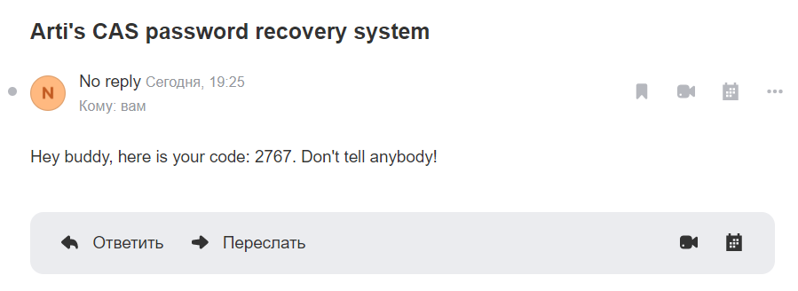
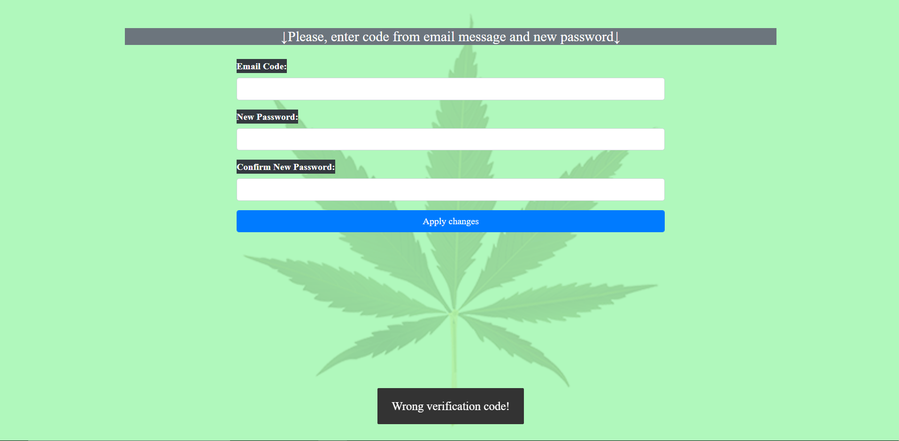
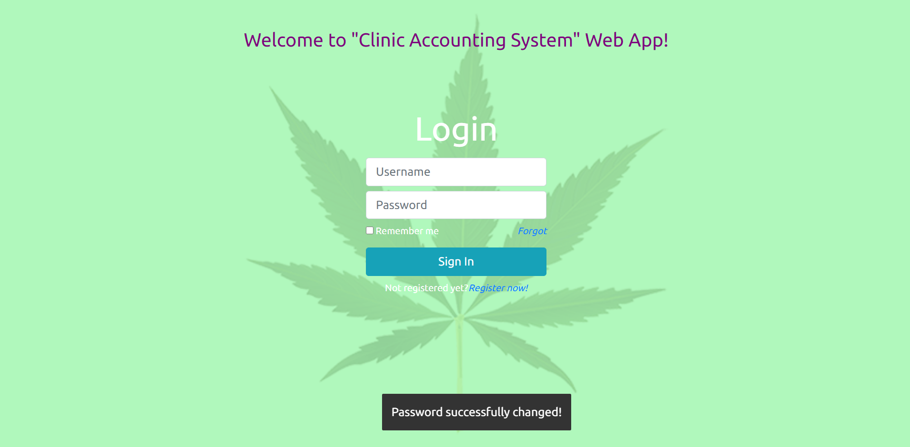
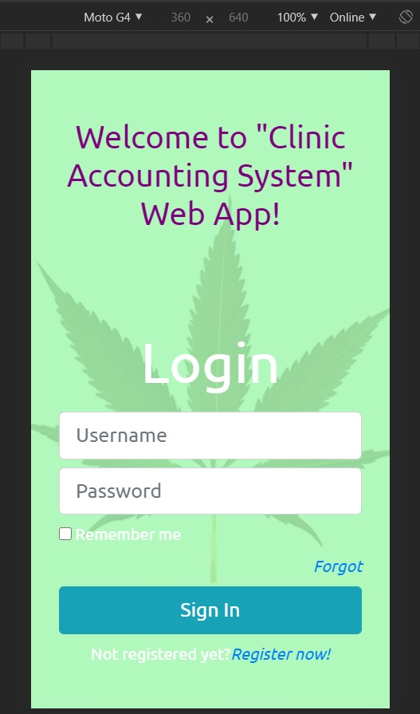
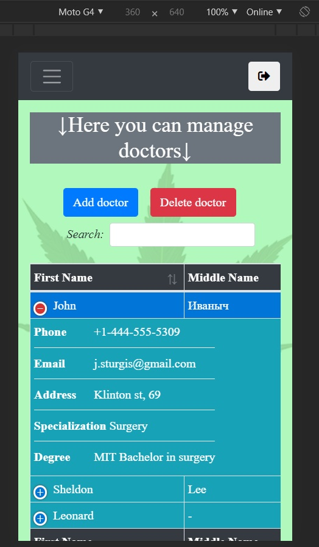
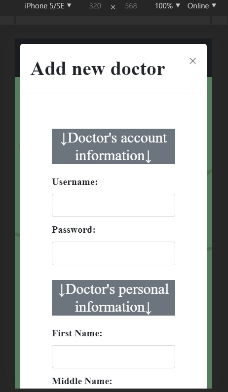
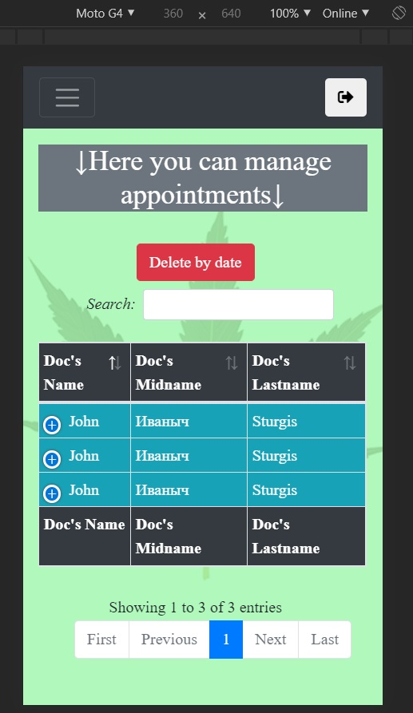
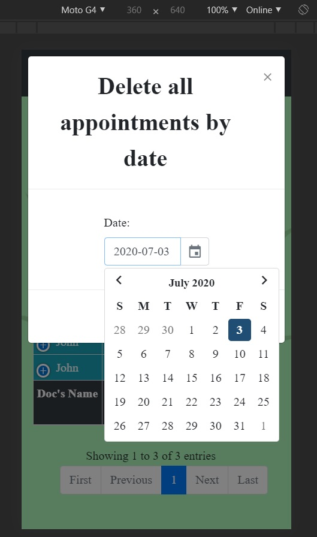

# Clinic Accounting System

### Clinic Accounting System tech stack:
* Java 8.
* Servlets.
* MySQL.
* C3P0.
* JSP, JSTL, EL.
* HTML, JS, Bootstrap, Datatables, Date picker.
* Log4j.
* Lombok.
* JavaMail.

### Deploy

Check deployed app [here](https://clinic-accounting-system.herokuapp.com/).

Couple accounts with valid creds for you to test the app(please, don't change this creds):

* admin role:
    * login: admin;
    * pass: admin;
	
* doc role:
	* login: firstDoc;
	* pass: firstDoc;
	
* patient/user role:
	* login: firstUser;
	* pass: firstUser;
	
If you are getting page with 500 error code when trying to login, that, probably, means that my hosting time for MySql db expired. 
If so, then write me on _tsvirkoartem@gmail.com_ and i'll fix it.

## Functionality overview:

* Sign In.
* Registration.
* Password recovery by email.
* Administrator
  * Can view/sort/search/add/delete `common` and `only for personal` events.
  * Can view/sort/search/add/delete doctors.
  * Can view/sort/search/edit/delete patients.
  * Can view/sort/search appointments and delete all old non-closed appointments by date.
* Doctor
  * Can view/sort/search/add `common` and `only for personal` events.
  * Can view/edit his own credentials and personal info.
  * Can view/sort/search doctors and make an appointment to other doctor.
  * Can view/sort/search patients and make edits in patient's medical history.
  * Can view/sort/search `him as a doctor` appointments and close them with a note in medical history.
  * Can view/sort/search `him as a patient` appointments.
* Patient
  * Can view/sort/search `common` events.
  * Can view/edit his own credentials and personal info.
  * Can view/sort/search doctors and make appointments to them.
  * Can view/sort/search his own appointments.

## Screenshots

### Sign In

	

### Registration

#### Username and password

	

#### Personal info application

	

### Password recovery by email

	

### Patient

#### Managing account info

	
	
	

#### Making appointments

	
	

### Doctor

#### Home Page

	

#### Creating new events

	

#### Personal information page

##### As patient

	

##### As doc

	

##### Changing personal info

	
	

#### Managing patients

	
	

#### Managing appointments

	

### Admin

#### Home

	

#### Managing events

	
	

#### Managing doctors

	
	
	

#### Managing patients

	
	

#### Managing appointments

	
	

### Recovery

#### Email code

	

#### Enter code page

	

#### Pass recovery success

	

### Mobile look

  
  
  
  
  

**Cheers!**

